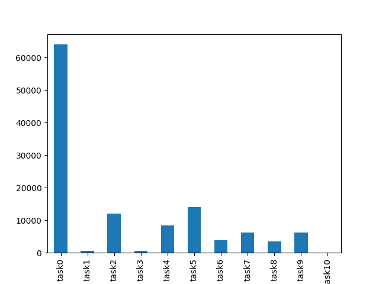
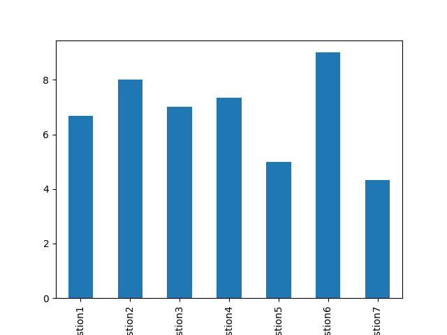
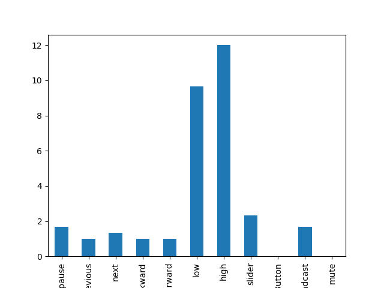
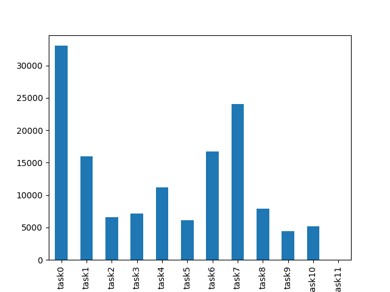

# Rapport sur les tests

## Testeurs
Marc    Heure: 11h20
Marco   Heure: 11h30
Sarah   Heure: 11h40

## Les instructions

<b>Voici les tests qui ont été effectués dans cet ordre.</b>

    Appuyez sur la touche broadcast.
    Mettez le volume au minimum.
    Mettez le volume au maximum.
    Mettez le volume en sourdine.
    Changez la langue en anglais.
    Passez à la prochaine vidéo.
    Avancez rapidement dans la vidéo.
    Reculez rapidement dans la vidéo.
    Changer le temps de la video à partir de la barre à un endroit de votre choix.
    Mettez la vidéo en pause.
    Passez à la vidéo précédente.

<b>Ces tests ont pour but de savoir s'il est facile d'utiliser la télécommande sur un téléphone intelligent.</b>

## Résultat des tests

Après avoir effectué des tests avec l'aide de nos collègues de classe (Merci à Marc-Antoine, Marco et Sarah).
Nous avons pu remarquer quelques soucis avec notre télécommande.

### commentaire laissé par chacun

    Marc : quelque boutton de votre telecommande n'etait pas assez grand.
    Marco : a premiere vue, il n'etait pas facile de savoir quel etait la barre de volume ou la barre de temps.
    Sarah : (meme remarque que Marco ) et Vous auriez pu faire mieux pour que votre manette soit visuellement plus attirant.

 
La première instruction a pris plus de temps seulement parce qu'il fallait leur expliquer comment le test allait se dérouler.
Sinon, on remarque que la plupart des taches ont été faites rapidement mis à part la tache 2,4 et 5.

    tache 2: Mettez le volume au minimum.
    tache 4: Passez à la prochaine vidéo.
    tache 5: Avancez rapidement dans la vidéo.

### explication
Tache 2 : D'après les commentaires de nos cobayes, le curseur de notre barre de volume n'était pas assez grand, donc il n'était pas facile pour certains d'effectuer cette tâche au premier essai. Il a aussi le fait que nos testeurs se sont trompés de barre, ils ont confondu notre barre de temps de la vidéo à celle de la barre de volume.
 
 
Tache 4 : les testeurs n'ont pas pu instinctivement faire la différence entre le bouton pour avancer le temps et changer de vidéo. Ainsi on a pu constater qu'il avaient de la difficulté à faire la différence entre les deux boutons.
 
 
Tache 5 : Même résultat que tache 4.

### conclusion
 D'après ce test et les commentaires que nous avons reçus. Nous aurions dû mettre la barre de volume à la verticale pour qu'il soit plus évident que cette barre était afin de changer le volume. De plus, afin qu'il soit plus facile d'interagir avec celle-ci, il aurait fallu qu'on agrandisse la taille du curseur du volume. Aussi, un petit «10» sur le logo du bouton pour avancer le temps aurait facilité la distinction entre celle-ci et le bouton pour passer à la prochaine vidéo.
 
 
 
## Les questions qui ont été posées

Voici la liste des questions qui ont été posées aux utilisateurs :

    question1 : Avez-vous trouvé qu'il était facile de comprendre les fonctions de chaque bouton à première vue ?
    question2 : Était-il facile pour vous d'utiliser les boutons de la manette ?
    question3 : Après avoir appuyé sur les boutons, trouvez-vous que leur retour haptique (feedback) était efficace ?
    question4 : Trouvez-vous que le moment où vous appuyez sur un bouton et l'exécution de l'action sur le Chromecast était rapide ?
    question5 : Selon vous, la manette convient-elle aux personnes peu à l'aise avec la technologie ?
    question6 : Avez-vous remarqué des erreurs liées au design UX ? (Merci de nous les signaler !)
    question7 : Est-ce que l'indicateur de volume est assez clair ?(par exemple : pouvez-vous différencier le niveau du volume quand il est à la moitié ou un volume au-dessus)

Nous avons posé ces questions pour nous aider à corriger et mieux comprendre les besoins de l'utilisateur pour ensuite faire de cette télécommande un outil simple et efficace à utiliser.
Leurs réponses et leurs commentaires nous ont aidés à voir plus clair dans nos erreurs.
 Par exemple,

    la barre de volume doit etre modifier (Question 5,6 et 7)
    
Nous avons conclu que la barre de volume était à refaire. Nous aurions dû le placer à la verticale, ajouter un bouton pour mettre le volume en sourdine et ajouter d'autres couleurs pour le rendre plus attrayant.

 # Nombre de cliques par boutons.

Le bouton "mute" n'existe pas. Donc, il n'y a aucun enregistrement pour la colonne mute. Même chose pour la colonne "Button".

On remarque que les boutons "low" et "high " ont le plus de cliques. Ceci est normal, puisque chaque «step» de la barre correspond à un appui.

Finalement, ce graphique ne montre rien d'anormal.

## Tests A/B

Entre la version A et la version B, nous avons changé les boutons pour le volume pour une barre afin de réduire. Nous avons fait ce changement sur l'hypothèse que si le volume était une barre, alors le volume serait plus facile à manipuler, parce qu'on aurait besoin de moins de clics pour aller entre les extrémités.
Voici les résultats des tests A et B.

- A 

- B

Nous pouvons voir que dans le test B, le temps pour les tâches reliées au volume (1,2,3) prend beaucoup moins de temps que dans le test A. ainsi, dans la version B, nous avons augmenté l'efficacité du volume.